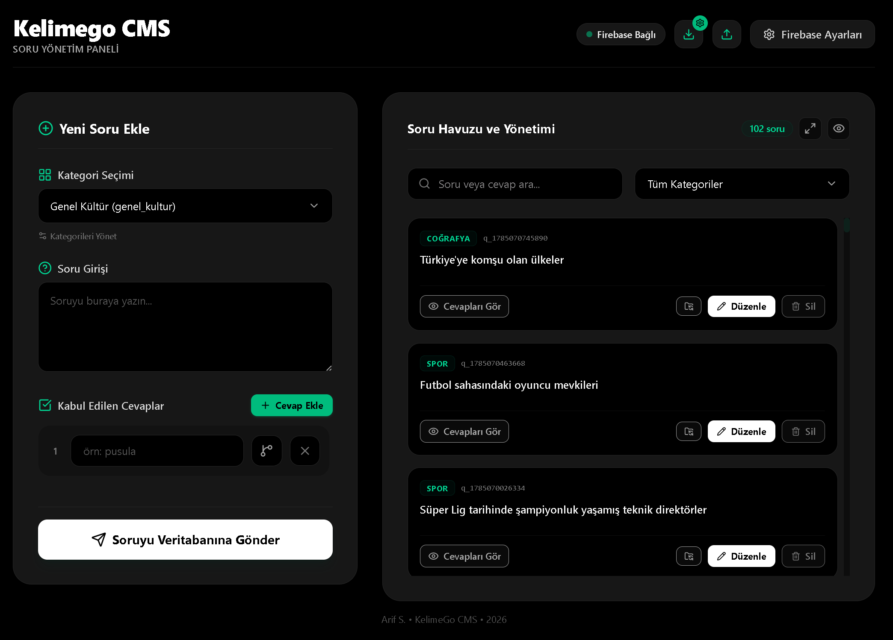
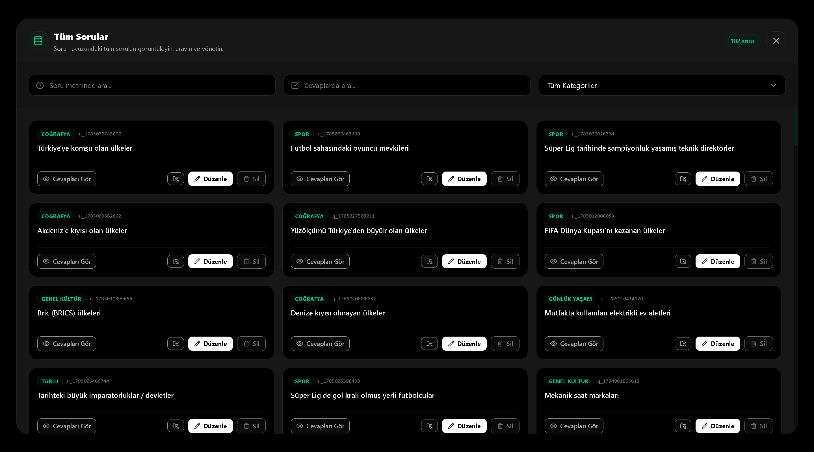

# KelimeGo CMS Prototype

> The original CMS prototype built for KelimeGo, later evolved into OpsBare.

## Overview

KelimeGo is an online multiplayer word puzzle game that stores its content in Firebase Realtime Database.

As the project grew, managing hundreds of questions, categories and alternative answers directly through the Firebase Console became increasingly inefficient. To solve this problem, I developed a lightweight localhost CMS dedicated to the game's content management.

Although originally designed specifically for KelimeGo, the ideas and architecture explored in this prototype eventually evolved into **OpsBare**—a standalone database management platform.

---

## Screenshots

<div align="center">
  <table>
    <tr>
      <td align="center">
        
        <br><br>
        <b>Dashboard</b>
      </td>
      <td align="center">
        
        <br><br>
        <b>Question Pool</b>
      </td>
    </tr>
  </table>
</div>
---

## Features

- Firebase Realtime Database integration
- Question management
- Category management
- Alternative answer management
- Localhost-based administration panel
- Lightweight single-file architecture

---

## Project Evolution

```text
KelimeGo
     │
     ▼
KelimeGo CMS Prototype
     │
     ▼
OpsBare
```

This repository represents the original prototype that inspired the development of OpsBare.

---

## Status

This project is no longer under active development.

It remains available as an open-source reference that documents the early development process behind OpsBare.

---

## License

This project is licensed under the [MIT License](LICENSE).
